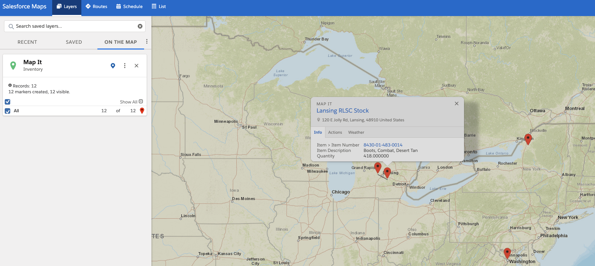

<h1 align="center">Dynamic SF Maps</h1>
<p align="center">This package contains apex classes to dynamically render the locations of different records returned by a SOQL query into Salesforce Maps.  The premise of this component is based off of <a href="https://help.salesforce.com/s/articleView?id=000354507&type=1">this Salesforce Maps documentation</a> which details how to pass records into a custom URL that will render a list of records in a custom layer on the Map. </p>

<!-- Sections below are Optional -->

---

## Summary

This component was originally designed for the Organization Clothing and Individual Equipment (OCIE) program for the U.S. Army.  The goal of this component was to render all of the warehouse locations that contained the requested order line items onto a dynamically created Salesforce Maps layer.  From the simple push of a button on the order form, users would be automatically redirected to a view of Salesforce Maps that displays all of the locations that contained the requested items on the order form.



The Apex mapping function is then embedded into a flow button that can be placed directly on the record page that you will call the action from, and then utilizes the <a href="https://unofficialsf.com/new-ways-to-open-web-pages-from-flow/">UnofficialSF OpenURL flow component</a> to open the layer in Salesforce Maps.

## Setup Instructions

This component relies on the specifically data model being used by the Salesforce org, and thus some minor configuration changes will be required in order to get this component working in your org.  First, ensure that the object you want to map (in this case inventory__c) is already defined in Salesforce Maps with a base object and both lat and long fields to store the geolocation.

Next we want to determine what types of records we are looking for (line 12 of the apex class).  In our case, we queried an object called sales_order__c and selected each of the sale order line items and stored them in a separate list.

```json
List<PBSI__PBSI_Sales_Order_Line__c> salesorderlinelist = [SELECT Id, PBSI__Item__c,PBSI__Item__r.Name, PBSI__Quantity_Needed__c FROM PBSI__PBSI_Sales_Order_Line__c where PBSI__Sales_Order__c =: currentId];
```

## Demo Script

Provide steps or general story for showcasing the package contents.

## Release History

A list of updates made over time after initial release. 

## Maintainer

Jack Galletta, Public Sector Solution Engineer

